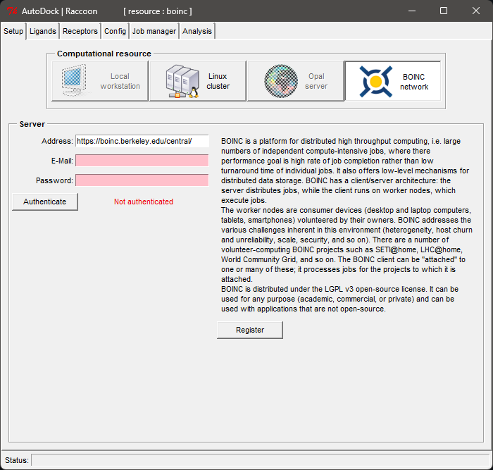

# Raccoon2 BOINC Plugin

This plugin extends the functionality of [Raccoon2](https://autodock.scripps.edu/resources/raccoon2/) application by adding support for [BOINC](https://boinc.berkeley.edu/).

It allows to run [Autodock Vina](https://vina.scripps.edu/) tasks on [BOINC Central](https://boinc.berkeley.edu/central/) infrastructure.

IMPORTANT: To submit tasks to [BOINC Central](https://boinc.berkeley.edu/central/), please [contact](https://boinc.berkeley.edu/anderson/) us.



## Installation

To install the plugin, you need to have Raccoon2 1.5.7 installed (could be taken from [here](https://ccsb.scripps.edu/mgltools/downloads/)) and plugin downloaded from the [releases](https://github.com/BOINC/Raccoon2_BOINC_Plugin/releases/tag/v1.0.1)

Then, navigate to the `MGLTOOLS_FOLDER` folder, and put `raccoon2_boinc_installer.py` there,
where `MGLTOOLS_FOLDER` is the folder where MGLTools is installed.

Finally, you can install the plugin using the following command:

### Linux/Mac:

```bash
./bin/pythonsh raccoon2_boinc_installer.py install
```

### Windows:
Before running the command, you need to start `cmd` as an administrator, then navigate to the `MGLTOOLS_FOLDER` folder.

```bash
python.exe raccoon2_boinc_installer.py install
```

where `MGLTOOLS_FOLDER` is the folder where MGLTools is installed.

## Uninstallation

To uninstall the plugin, navigate to the `MGLTOOLS_FOLDER` folder, and put `raccoon2_boinc_installer.py` there,
where `MGLTOOLS_FOLDER` is the folder where MGLTools is installed.

Then you can use the following command:

### Linux/Mac:

```bash
./bin/pythonsh raccoon2_boinc_installer.py uninstall
```

### Windows:
Before running the command, you need to start `cmd` as an administrator, then navigate to the `MGLTOOLS_FOLDER` folder.

```bash
python.exe raccoon2_boinc_installer.py uninstall
```

where `MGLTOOLS_FOLDER` is the folder where MGLTools is installed.
